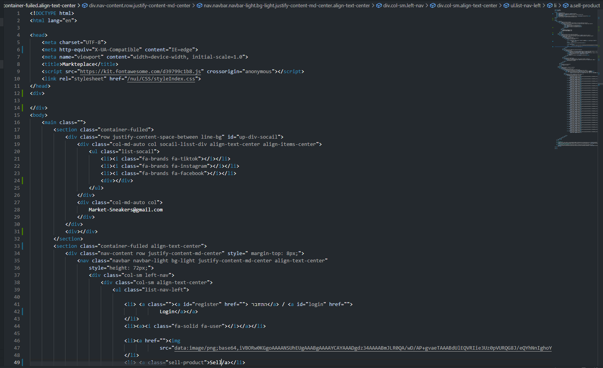

Here is cool theme you can use created by | Yair#6962

Preview 
<picture>
  <source media="(prefers-color-scheme: dark)" srcset="image/preview.png">
  <source media="(prefers-color-scheme: light)" srcset="image/preview.png">
  
</picture>
